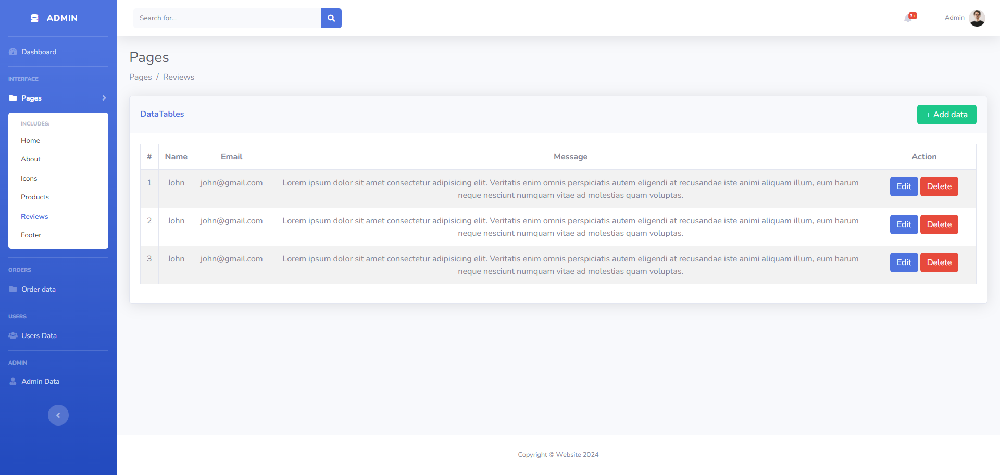

# PHP Website

Create PHP website with using:

- PHP (PDO)
- HTML
- CSS
- JS
- MySQL

 

How to install this project

1. create database 'flower'
2. import 'flower.sql' in database
3. login admin
   - user: admin
   - password: 1234
4. login user
   - user: admin@gmail.com
   - password: 1234

## Home page
 

 

## Shop page (when user login)
 

 

## Cart page

 

 

## Dashboard page
 

 

 

 

 

 

 

 

