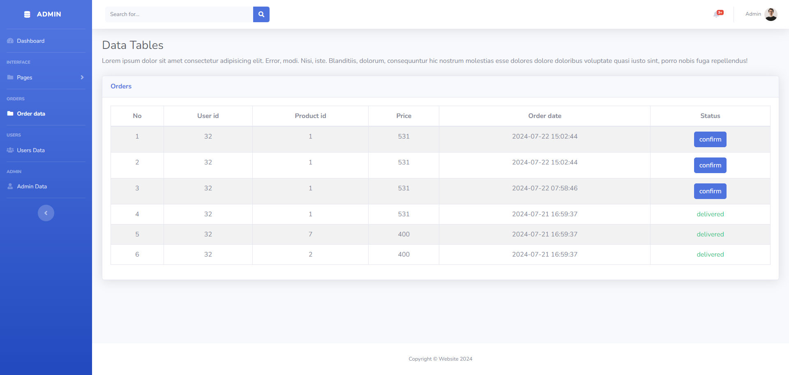

# PHP Website

Create PHP website with using:

- HTML
- CSS
- JavaScript
- PHP (PDO)
- SQL

 

## Home
 

 

## Shop
 

 

## Cart
 

 

## Cart
 

 

## Profile
 

 

## History
 

 

## Cart
 

 

## Dashboard
 

 

 

 

 

 

 

 

 
